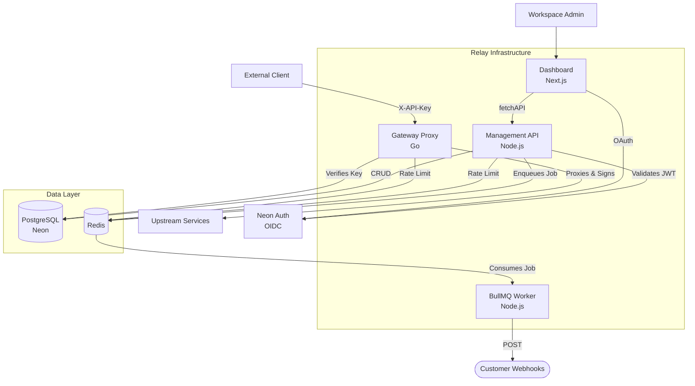
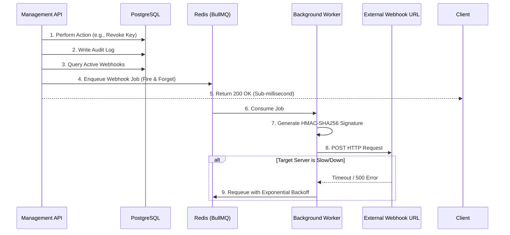
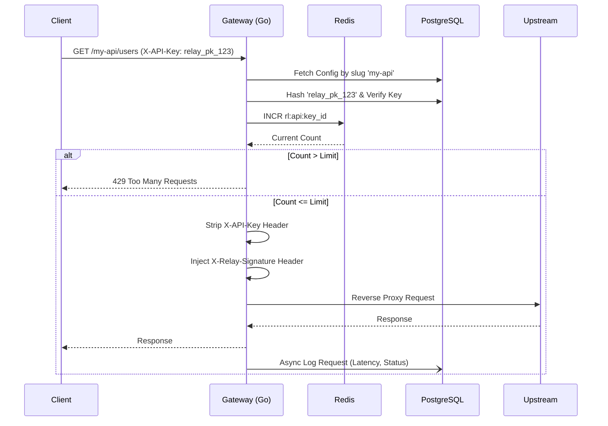

# High-Level Design (HLD): Relay

## 1. System Overview

Relay is a distributed API management platform consisting of three primary components: a high-throughput edge proxy (Gateway), a robust control plane (Management API), and an intuitive admin interface (Dashboard). 

## 2. Component Architecture

### 2.1 Management API (Control Plane)
- **Tech Stack**: Node.js, Express, TypeScript.
- **Responsibility**: Serves as the source of truth for the entire system. Handles all administrative CRUD operations (Workspaces, APIs, Keys, Webhooks, Members).
- **Authentication**: Validates OpenID Connect JWTs provided by Neon Auth using JWKS. It also supports `relay_ws_*` prefixed Personal Access Tokens for programmatic access.
- **Rate Limiting**: Protects administrative routes using an `X-Forwarded-For` aware Redis sliding window (500 requests/minute/user).

### 2.2 Gateway (Data Plane)
- **Tech Stack**: Go (Golang), standard library `net/http`.
- **Responsibility**: Sits in the critical path of external client requests. It must be blazing fast and highly available.
- **Routing**: Extracts the configured API slug from the URL path, looks up the destination `upstream_url`, and creates a reverse proxy.
- **Resilience**: Implements a custom `RoundTripper` transport that automatically catches 502/503/504 errors from upstream services and executes a rapid retry with backoff.

### 2.3 Dashboard (Presentation Layer)
- **Tech Stack**: Next.js 16 (App Router), React 19.
- **Responsibility**: Provides the graphical interface for admins.
- **Data Flow**: Utilizes Next.js Server Components to securely fetch data from the Management API using a forwarded session cookie, ensuring zero client-side exposure of sensitive tokens.

## 3. Core Subsystems Design

### 3.1 Authentication & Authorization
Relay employs a dual-authentication strategy:
1. **Human Users**: Authenticated via Google OAuth through Neon Auth. The Dashboard receives a secure HTTP-only session cookie. The Management API verifies this token against Neon's `/get-session` endpoint and caches the result for 60 seconds.
2. **Machine Clients**: Authenticated via SHA-256 hashed API Keys. The Gateway performs a fast constant-time hash comparison against the PostgreSQL database.

### 3.2 Asynchronous Webhook Dispatch Pipeline
To prevent the "Dual Write Problem" and ensure the Management API is never blocked by slow third-party webhook receivers, Relay uses a strict event-driven queue:

### 3.3 Gateway Proxy & Rate Limiting Flow
The Gateway uses a Redis-backed sliding window algorithm for exact rate limit enforcement across horizontally scaled Gateway instances.

## 4. Scalability & Performance Considerations

- **Gateway Scaling**: The Go Gateway is entirely stateless (relying on Postgres and Redis). It can be scaled horizontally to hundreds of instances behind a Layer 4 Load Balancer.
- **Database Pooling**: The Gateway creates a persistent connection pool to PostgreSQL upon startup to eliminate TCP handshake overhead on incoming requests.
- **Cache Eviction**: The Management API's in-memory session cache automatically expires stale records after 60 seconds, preventing memory leaks while significantly reducing database load for active sessions.

## 5. Security Posture

1. **Hash-Only Storage**: Plaintext API keys are never stored in the database. They are hashed using SHA-256 before storage. If the database is compromised, the keys remain secure.
2. **Upstream Validation**: To ensure external users cannot bypass Relay and hit upstream servers directly, Relay injects a pre-shared secret (`X-Relay-Signature`) into proxied requests. Upstream servers can validate this header to guarantee the request was sanitized and rate-limited by Relay.
3. **Privilege Escalation Limits**: The Management API enforces strict workspace boundaries. Middleware verifies the user's `workspace_id` against the `workspace_members` table on every protected route.
