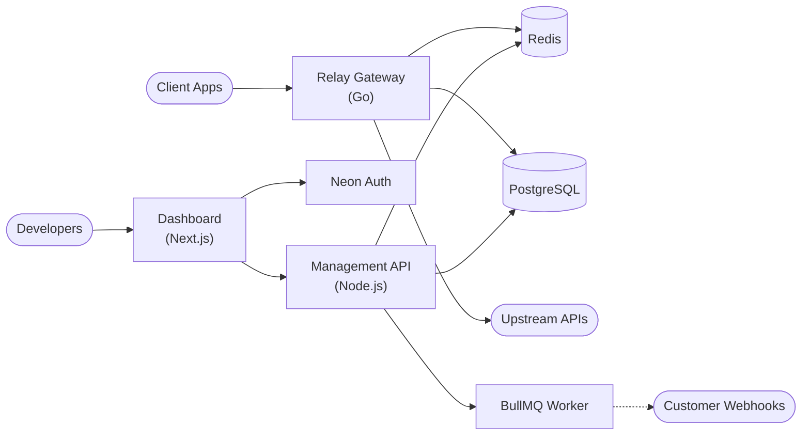

<div align="center">
  <br />
  <h1>RELAY</h1>
  <p>
    <strong>A high-performance, open-source API management platform and gateway.</strong>
  </p>
  <br />

  [](https://opensource.org/licenses/MIT)
  [](https://github.com/mohitdebian/Relay/actions/workflows/ci.yml)
  
  [](./PRD.md)
  [](./HLD.md)
  [](./LLD.md)
  [](./design.md)
</div>

<br />

Relay is a self-hosted, lightweight alternative to enterprise API gateways. It provides a Go-based reverse proxy coupled with a Next.js dashboard for managing API keys, rate limits, analytics, and webhooks.

## Documentation

- **[Product Requirements Document (PRD)](./PRD.md)** - Feature specifications and product goals.
- **[High-Level Design (HLD)](./HLD.md)** - System component architecture.
- **[Low-Level Design (LLD)](./LLD.md)** - Database schema (ER diagram), rate-limiting algorithms, and queue architecture.
- **[Design System & UI](./design.md)** - Frontend architecture and design guidelines.

## Features

- **Go Gateway Proxy**: Fast reverse proxy with zero-downtime routing, retry transports, and connection pooling.
- **API Key Management**: Secure SHA-256 hashed API keys with prefixes, expiration dates, and one-click revocation.
- **Configurable Rate Limiting**: Per-API sliding-window rate limiting backed by Redis.
- **Real-time Analytics**: Monitor request volumes, latencies, and status code distributions directly from the dashboard.
- **Asynchronous Webhooks**: Event-driven webhook dispatch with HMAC-SHA256 signatures, exponential backoff, and BullMQ queues.
- **Multi-Workspace & RBAC**: Isolate environments and invite team members with Owner, Admin, or Viewer roles.
- **Audit Logging**: Complete trail of all actions performed within a workspace.

## Architecture



## Getting Started

### Prerequisites
- Node.js 20+
- Go 1.21+
- PostgreSQL
- Redis

### Installation

1. **Clone the repository**
   ```bash
   git clone https://github.com/mohitdebian/Relay.git
   cd Relay
   ```

2. **Setup Management API**
   ```bash
   cd apps/api
   npm install
   cp .env.example .env
   # Configure your DATABASE_URL and REDIS_URL in .env
   npm run dev
   ```

3. **Setup Dashboard**
   ```bash
   cd apps/dashboard
   npm install
   cp .env.example .env.local
   # Configure NEXT_PUBLIC_API_URL and auth settings
   npm run dev
   ```

4. **Setup Gateway Proxy**
   ```bash
   cd gateway
   go mod download
   # Set DATABASE_URL and REDIS_URL environment variables
   go run .
   ```

## Tech Stack

| Component | Technology | Description |
| :--- | :--- | :--- |
| **Gateway** | Go, `net/http` | High-performance edge proxy |
| **Management API** | Node.js, Express, TypeScript | RESTful control plane |
| **Dashboard** | Next.js 16, React 19, Vanilla CSS | Server-side rendered admin UI |
| **Database** | PostgreSQL (Neon Serverless) | Primary data store |
| **Cache & Queues**| Redis, BullMQ | Rate limiting and async job processing |
| **Authentication**| Neon Auth | Secure OpenID Connect user management |

## Project Structure

```text
relay/
├── apps/
│   ├── api/          # Management API (Node.js/Express)
│   └── dashboard/    # Web UI (Next.js 16)
├── gateway/          # API Gateway Proxy (Go)
├── .github/          # CI/CD Workflows
└── docker-compose.yml
```

## Contributing

We love contributions! Whether it's bug reports, feature requests, or pull requests, all contributions are welcome. Please read our contributing guidelines before submitting a PR.

## License

This project is licensed under the MIT License - see the [LICENSE](LICENSE) file for details.
